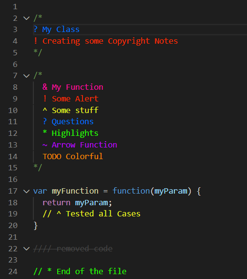

# Highlighted Comments for VS Code

Enhance your code readability by adding colorful, semantic highlights to your comments. This extension allows you to categorize comments into alerts, queries, info, todos, and more using simple prefixes, making it easier to scan and understand your codebase.



## Features

*   🎨 **Color-Coded Comments**: Easily distinguish between different types of comments (e.g., Red for Alerts, Blue for Queries).
*   🏷️ **Custom Tags**: Define your own tags, colors, and styles in the settings.
*   📝 **Plain Text Support**: Optionally highlight comments in plain text files.
*   🌈 **Visual Distinction**: Style commented-out code to make it less intrusive.
*   ✅ **Wide Language Support**: Works with over 60 languages and file types.

## Usage

Simply add one of the default prefixes to your comment, **followed by a space**.

Each color comes in a standard (`!`) and a brighter (`+!`) variant.

*   `!` : <span style="color:#808080">Grey</span> (Default)
*   `R!` / `R+!` : <span style="color:#FF3333">Red</span> (Alert / Critical)
*   `O!` / `O+!` : <span style="color:#F96F00">Orange</span> (Warning / To-Do)
*   `Y!` / `Y+!` : <span style="color:#BAC602">Yellow</span> (Note / Important)
*   `G!` / `G+!` : <span style="color:#00CF00">Green</span> (Success / Tip)
*   `B!` / `B+!` : <span style="color:#40A0FF">Blue</span> (Info / Question)
*   `M!` / `M+!` : <span style="color:#DE50FF">Magenta</span> (Tag / Section)
*   `P!` / `P+!` : <span style="color:#FF8080">Pink</span> (Highlight)

> **Note:** As of version 1.0.1, a **whitespace character (space or tab) is required** after the tag for the comment to be highlighted. This prevents accidental highlighting of constructs like shebangs (`#!`).
>
> *   ✅ `// R! Critical Error`
> *   ❌ `// R!Critical Error` (No space)

## Examples

### Python
```python
# R! Critical: This function must be called first
def init():
    # G! Initialize the core system
    setup_core()

    # B? Should we add a timeout here? (You might want to customize '?' tag)
    # B! Question: Should we add a timeout?
    connect_to_db()

    # O! TODO: Refactor this error handling
    try:
        process_data()
    except:
        pass
```

### C++
```cpp
// R! Memory leak potential if not handled
void* ptr = malloc(100);

// G+! Perform the calculation
int result = calculate(ptr);

// B! strict check required?
if (result > 0) {
    // P! Updated logic for v2.0
    save(result);
}

// ! Old cleanup method (Grey)
free(ptr);
```

### HTML
```html
<!-- R! Do not remove this meta tag -->
<meta charset="UTF-8">

<!-- M! Main Navigation Section -->
<nav>
    <!-- B! Is this ID unique? -->
    <ul id="main-menu">
        <li>Home</li>
    </ul>
</nav>

<!-- O! Add footer section -->
```

### JavaScript / TypeScript
```javascript
// R! Deprecated: Use fetchUserV2 instead
function fetchUser() {
    // G! Call the API
    const data = api.get('/user');

    // B! returns promise or object?
    return data;
}

// O! TODO: Implement error handling
```

### Java
```java
// R! Thread-safety required
public void run() {
    // G! Start the process
    this.start();

    // B! Is this synchronized?
    this.update();

    // ! System.out.println("Debug info");
}
```

## Configuration

This extension can be configured in User Settings or Workspace settings.

### Enable/Disable Features

*   `"highlighted-comments.multilineComments": true`
    *   Controls whether multiline comments (block comments) are styled.
*   `"highlighted-comments.highlightPlainText": false`
    *   Controls whether comments in plain text files are styled. When true, tags at the start of a line will be highlighted.

### Custom Tags

You can modify existing tags or add new ones using the `tags` setting.

`"highlighted-comments.tags"`

Defaults:
```json
[
    {
        "tag": "Y!",
        "color": "#000000",
        "strikethrough": false,
        "backgroundColor": "#BAC602"
    },
    {
        "tag": "Y+!",
        "color": "#000000",
        "strikethrough": false,
        "backgroundColor": "#EAF622"
    },
    {
        "tag": "G!",
        "color": "#000000",
        "strikethrough": false,
        "backgroundColor": "#00CF00"
    },
    {
        "tag": "G+!",
        "color": "#000000",
        "strikethrough": false,
        "backgroundColor": "#40FF40"
    },
    {
        "tag": "M!",
        "color": "#000000",
        "strikethrough": false,
        "backgroundColor": "#DE50FF"
    },
    {
        "tag": "M+!",
        "color": "#000000",
        "strikethrough": false,
        "backgroundColor": "#AE10DF"
    },
    {
        "tag": "B!",
        "color": "#000000",
        "strikethrough": false,
        "backgroundColor": "#40A0FF"
    },
    {
        "tag": "B+!",
        "color": "#000000",
        "strikethrough": false,
        "backgroundColor": "#80E0FF"
    },
    {
        "tag": "P!",
        "color": "#000000",
        "strikethrough": false,
        "backgroundColor": "#FF8080"
    },
    {
        "tag": "P+!",
        "color": "#000000",
        "strikethrough": false,
        "backgroundColor": "#FF06A0"
    },
    {
        "tag": "R!",
        "color": "#000000",
        "strikethrough": false,
        "backgroundColor": "#FF3333"
    },
    {
        "tag": "R+!",
        "color": "#000000",
        "strikethrough": false,
        "backgroundColor": "#FF7373"
    },
    {
        "tag": "O!",
        "color": "#000000",
        "strikethrough": false,
        "backgroundColor": "#F96F00"
    },
    {
        "tag": "O+!",
        "color": "#000000",
        "strikethrough": false,
        "backgroundColor": "#FF782C"
    },
    {
        "tag": "!",
        "color": "#000000",
        "strikethrough": false,
        "backgroundColor": "#808080"
    }
]
```

## Supported Languages 

* Ada
* AL
* Apex
* AsciiDoc
* BibTeX
* BrightScript
* C
* C#
* C++
* ColdFusion (CFML)
* Clojure
* COBOL
* CoffeeScript
* CSS
* D
* Dart
* Diagram (PlantUML)
* Dockerfile
* Elixir
* Elm
* Erlang
* Flax
* F#
* Fortran (Modern)
* GDScript
* GenStat
* Go
* GraphQL
* Groovy
* Haskell
* Haxe
* HiveQL
* HTML
* Java
* JavaScript
* JavaScript React
* JSON with comments
* Julia
* Kotlin
* LaTeX (incl. BibTeX)
* Less
* Lisp
* Lua
* Makefile
* Markdown
* MATLAB
* Nim
* Objective-C
* Objective-C++
* ObjectPascal
* Pascal
* Perl
* Perl 6
* PHP
* Pig
* PlainText
* PlantUML
* PL/SQL
* PowerShell
* Puppet
* Python
* R
* Racket
* Ruby
* Rust
* SAS
* Sass
* Scala
* SCSS
* ShaderLab
* ShellScript
* SQL
* Stata
* Stylus
* Swift
* Tcl
* Terraform
* Twig
* TypeScript
* TypeScript React
* VB (Visual Basic)
* Verilog
* Vue.js
* XML
* YAML

## Manual Install
`code --install-extension highlighted-comments-1.0.1.vsix`
